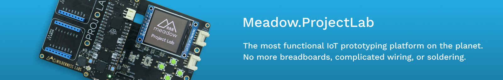
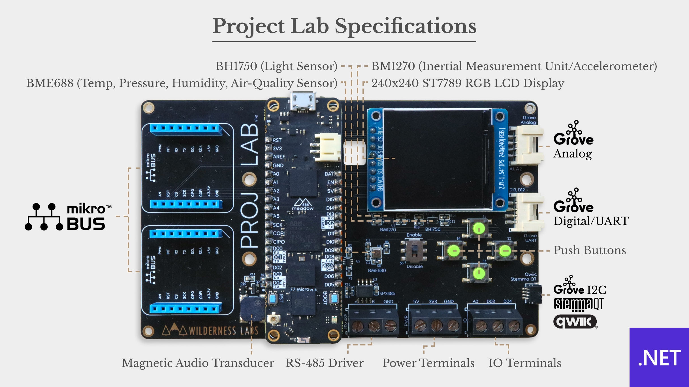
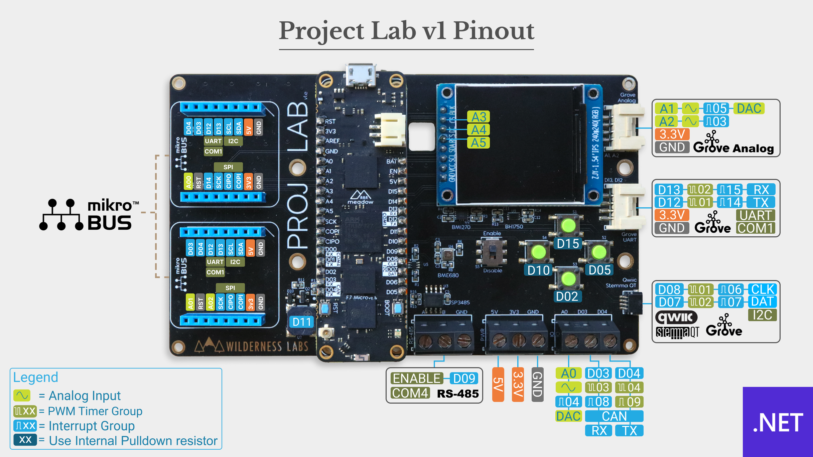

# Meadow.ProjectLab

Project Lab is the most functional IoT prototyping platform on the planet. No more breadboards, complicated wiring, or soldering. Project Lab was built from the ground up using the industry's most powerful, capable, and reliable sensors, components, and connectors.

## Purchasing or Building

You can get a Project Lab from the [Wilderness Labs store](https://store.wildernesslabs.co/collections/frontpage/products/project-lab-board).

It's also designed so that it can be assembled at home for the adventurous. All design files can be found in the [Hardware Design folder](Source/Hardware).

## Getting Started

1. **[Setup your Meadow Build Environment](http://developer.wildernesslabs.co/Meadow/Getting_Started/Deploying_Meadow/)** - If you haven't deployed a Meadow app before, you'll need to setup your IDE extension(s), deploy Meadow.OS, etc.
2. **[Run the Demo App](Source/ProjectLab_Demo)** - Deploy the Project Lab demonstration app to see the built in peripherals at work.
3. **[Check out the Project Lab Samples](https://github.com/WildernessLabs/Meadow.ProjectLab.Samples)** - We recommend cloning the [Meadow.ProjectLab.Samples](https://github.com/WildernessLabs/Meadow.ProjectLab.Samples) repo. There you'll find a bunch of awesome samples that you can run right out-of-the box!  
    
4. **[Add the Project Lab Nuget Package to your own app](https://github.com/WildernessLabs/Meadow.ProjectLab/tree/Demo_App_and_Getting_Started#project-lab-nuget)** - We've created a [Nuget package](https://www.nuget.org/packages/Meadow.ProjectLab) that simplifies using the Project Lab hardware by automatically instiantes the hardware classes for you and makes them available for use in your app. More information on how to use is [below](https://github.com/WildernessLabs/Meadow.ProjectLab/tree/Demo_App_and_Getting_Started#project-lab-nuget).

## About the Hardware



### Onboard Peripherals

Project Lab includes the following hardware:
* **ST7789** - SPI 240x240 color display
* **BMI270** - I2C motion and acceleration sensor
* **BH1750** - I2C light sensor
* **BME688** - I2C atmospheric sensor
* **Push Button** - 4 momentary buttons
* **Magnetic Audio Transducer** - High quality piezo speaker

### Connectivity

The PROJ LAB board includes the following expansion connection options:
* **MikroBUS** - Two sets of MikroBUS pin headers
* **Qwiic** - Stemma QT I2C connector
* **Grove** - Analog header
* **Grove** - GPIO/serial header
* **RS-485** - serial 

As well as connectors to 5V, 3.3V, ground, one analog port and 2 GPIO ports.

## Project Lab Nuget

To make using the hardware even simpler, we've created a Nuget package that instantiates and encapsulates the onboard hardware into a `ProjectLab` class. To use:

1. Add a reference to the nuget package: 
    `dotnet add package Meadow.ProjectLab`
2. Instantiate the `ProjectLab` class:  
    ```csharp
    public class MeadowApp : App<F7FeatherV2>
    {
        ProjectLab projLab;

        public override Task Initialize()
        {
            projLab = new ProjectLab();
            ...
    ```
3. Access the `ProjectLab` peripherals:
   ```csharp
            if (projLab.EnvironmentalSensor is { } bme688)
            {
                bme688.Updated += Bme688Updated;
                bme688.StartUpdating(TimeSpan.FromSeconds(5));
            }
    ```

 * [Explore in Fuget.org](https://www.fuget.org/packages/Meadow.ProjectLab/0.1.0/lib/netstandard2.1/ProjectLab.dll/Meadow.Devices/ProjectLab)
 * [Nuget Source](Source/Meadow.ProjectLab)


## Pinout Diagram

Check the diagrams below to see what pins on the Meadow are connected to every peripheral on board:
&nbsp;

### v1



### v2

Coming soon!

## [Hardware Design](Source/Hardware)

You can find the schematics and other design files in the [Hardware folder](Source/Hardware).