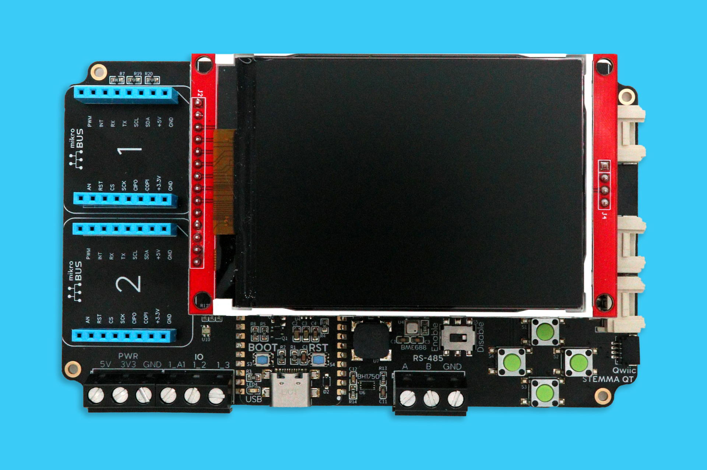

# Meadow.ProjectLab

Project Lab is the most functional IoT prototyping platform on the planet. No more breadboards, complicated wiring, or soldering. Project Lab was built from the ground up using the industry's most powerful, capable, and reliable sensors, components, and connectors.

## Contents
* [Purchasing or Building](#purchasing-or-building)
* [Getting Started](#getting-started)
* [Hardware Specifications](#hardware-specifications)
* [Pinout Diagram](#pinout-diagram)
  * [Project Lab v1.e](#project-lab-v1e)
  * [Project Lab v2.e](#project-lab-v2e)
* [Additional Samples](#additional-samples)

## Purchasing or Building

<table width="100%">
    <tr>
        <td>
            
        </td>
        <td>
             
        </td>
    </tr>
    <tr>
        <td>
            You can get a Project Lab fully assembled from the <a href="https://store.wildernesslabs.co/collections/frontpage/products/project-lab-board">Wilderness Labs store</a>.
        </td>
        <td> 
            It's also designed so that it can be assembled at home for the adventurous. All design files can be found in the <a href="/Hardware">Hardware Design</a> folder.
        </td>
    </tr>
</table>

## Getting Started

To make using the hardware even simpler, we've created a Nuget package that instantiates and encapsulates the onboard hardware into a `ProjectLab` class.

1. Add the ProjectLab Nuget package your project: 
    - `dotnet add package Meadow.ProjectLab`, or
    - [Meadow.ProjectLab Nuget Package](https://www.nuget.org/packages/Meadow.ProjectLab)
    - [Explore in Fuget.org](https://www.fuget.org/packages/Meadow.ProjectLab/0.1.0/lib/netstandard2.1/ProjectLab.dll/Meadow.Devices/ProjectLab)

2. Instantiate the `ProjectLab` class:  
```csharp
public class MeadowApp : App<F7FeatherV2>
{
    IProjectLabHardware projLab;

    public override Task Initialize()
    {
        projLab = ProjectLab.Create();
        ...
```

3. To Access the `Project Lab` onboard peripherals:
```csharp
    if (projLab.EnvironmentalSensor is { } bme688)
    {
        bme688.Updated += Bme688Updated;
        bme688.StartUpdating(TimeSpan.FromSeconds(5));
    }
```

4. To use an I2C peripheral (with a [Grove Character display](https://wiki.seeedstudio.com/Grove-16x2_LCD_Series) as an example):
```csharp
    var display = new CharacterDisplay
    (
        i2cBus: projLab.I2cBus,
        address: (byte)I2cCharacterDisplay.Addresses.Grove,
        rows: 2, columns: 16,
        isGroveDisplay: true
    );
```

## Hardware Specifications


<table>
    <tr>
        <th>Onboard Peripherals</th>
        <th>Connectivity</th>
    </tr>
    <tr>
        <td><strong>ST7789</strong> - SPI 240x240 color display</li></td>
        <td><strong>MikroBUS</strong> - Two sets of MikroBUS pin headers</td>
    </tr>
    <tr>
        <td><strong>BMI270</strong> - I2C motion and acceleration sensor</td>
        <td><strong>Qwiic</strong> - Stemma QT I2C connector</td>
    </tr>
    <tr>
        <td><strong>BH1750</strong> - I2C light sensor</td>
        <td><strong>Grove</strong> - Analog header</td>
    </tr>
    <tr>
        <td><strong>BME688</strong> - I2C atmospheric sensor</td>
        <td><strong>Grove</strong> - GPIO/serial header</td>
    </tr>
    <tr>
        <td><strong>Push Button</strong> - 4 momentary buttons</td>
        <td><strong>RS-485</strong> - Serial</td>
    </tr>
    <tr>
        <td><strong>Magnetic Audio Transducer</strong> - High quality piezo speaker</td>
        <td><strong>Ports</strong> - 3.3V, 5V, ground, one analog and two GPIO ports</td>
    </tr>
</table>

You can find the schematics and other design files in the [Hardware folder](Source/Hardware).

## Pinout Diagram

Check the diagrams below to see what pins on the Meadow are connected to every peripheral on board and its connectors:
&nbsp;

### Project Lab v1.e


### Project Lab v2.e


## Additional Samples

1. **[Setup your Meadow Build Environment](http://developer.wildernesslabs.co/Meadow/Getting_Started/Deploying_Meadow/)** - If you haven't deployed a Meadow app before, you'll need to setup your IDE extension(s), deploy Meadow.OS, etc.
2. **[Run the Demo App](Source/ProjectLab_Demo)** - Deploy the Project Lab demonstration app to see the built in peripherals at work.
3. **[Check out the Project Lab Samples](https://github.com/WildernessLabs/Meadow.ProjectLab.Samples)** - We recommend cloning the [Meadow.ProjectLab.Samples](https://github.com/WildernessLabs/Meadow.ProjectLab.Samples) repo. There you'll find a bunch of awesome samples that you can run right out-of-the box! 
<a href="https://github.com/WildernessLabs/Meadow.ProjectLab.Samples">
    
</a>